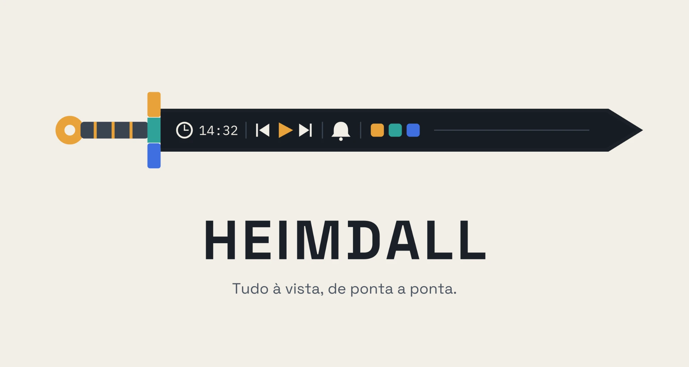

<p align="center">
  
</p>

<h1 align="center">Heimdall</h1>

<p align="center">Uma barra de sistema para Windows que faz o que a barra de tarefas deveria fazer.</p>

<p align="center">
  
  
  
</p>

---

Fixa numa borda da tela (ou flutuando, com cantos arredondados), reunindo relógio,
controle de mídia, lembretes e atalhos dos seus apps num só lugar, com o visual que você
escolher. Ela se recolhe automaticamente para um overlay discreto quando um jogo em tela
cheia é aberto, e volta ao normal quando ele fecha.

## Por que usar

- **Relógio sempre visível**, no formato e fuso que você quiser.
- **Controle de mídia** para Spotify, YouTube ou qualquer player — play/pause, próxima
  faixa, capa do álbum, progresso e volume por app, sem precisar abrir a janela.
- **Lembretes** rápidos ou agendados, com recorrência, aviso visual na barra e histórico.
- **Atalhos de apps** direto na barra — arraste um arquivo, uma pasta ou escolha entre os
  apps instalados.
- **9 temas prontos** (Escuro, Claro, Acrílico, Mica, Vidro, Destaque do Windows, Auto...)
  com suporte a temas próprios em JSON.
- **Modo overlay automático**: em jogos e apps de tela cheia, a barra normal some e um
  overlay discreto e somente informativo assume o lugar, sem interceptar clique.
- **Leve e nativo**: WPF puro, sem Electron e sem serviço em segundo plano consumindo RAM.

## Baixar e instalar

Não é necessário compilar nada — baixe o executável já pronto:

**[Baixar a última versão](https://github.com/yansntss/Heimdall/releases/latest)**

1. Baixe o `.zip` (ou `.exe`) da versão mais recente no link acima.
2. Extraia (se for `.zip`) numa pasta de sua preferência.
3. Execute o `Heimdall.exe`.
4. Opcional: clique direito na barra → **Configurações...** → aba **Geral** → marque
   **"Iniciar com o Windows"** para que ela abra automaticamente ao ligar o PC.

> Requer Windows 10 ou 11. A versão "leve" precisa do
> [.NET 10 Desktop Runtime](https://dotnet.microsoft.com/download/dotnet/10.0) instalado
> na máquina; a versão "self-contained" já traz tudo embutido e roda sem instalar nada
> extra.
>
> Ainda não há releases publicados? Veja [Rodar localmente](#rodar-localmente) para
> compilar a partir do código-fonte.

## Rodar localmente

Para quem quer testar em modo desenvolvimento ou contribuir com código.

**Pré-requisitos:**
- Windows 10/11
- [.NET 10 SDK](https://dotnet.microsoft.com/download/dotnet/10.0)

**Passos:**

```bash
git clone https://github.com/yansntss/Heimdall.git
cd Heimdall
dotnet run
```

A barra deve aparecer na borda da tela.

**Gerando seu próprio build:**

```bash
# Leve (requer o .NET 10 Desktop Runtime instalado na máquina que for rodar)
dotnet publish -c Release -r win-x64 --self-contained false -p:PublishSingleFile=true

# Self-contained (maior, mas roda em qualquer PC Windows sem instalar nada)
dotnet publish -c Release -r win-x64 --self-contained true -p:PublishSingleFile=true
```

O executável final fica em `bin/Release/net10.0-windows.../win-x64/publish/`.

## Configuração

Tudo pode ser ajustado pela interface: clique direito na barra → **Configurações...**
abre uma janela com abas de borda/tamanho, aparência/temas, widgets e lembretes.
"Salvar e recarregar" aplica as mudanças na hora, sem reiniciar o app.

Quem preferir também pode editar o JSON diretamente em
`%AppData%\Heimdall\config.json`:

```jsonc
{
  "Edge": "Top",               // Top | Bottom | Left | Right
  "Thickness": 28,              // DIPs
  "FloatingMode": false,        // true = barra flutuante (margem + cantos arredondados)
  "MonitorMode": "Primary",     // Primary | Specific | All
  "Theme": "Escuro",            // tema embutido ou salvo em .../themes/*.json
  "Widgets": { "Start": [], "Center": [{ "Id": "clock" }], "End": [{ "Id": "media" }, { "Id": "reminder" }, { "Id": "launcher" }] }
}
```

Detalhes completos de cada opção, dos widgets, temas customizados e da estrutura interna
do projeto estão em [`docs/GUIA.md`](docs/GUIA.md).

## Widgets disponíveis

| Widget | O que faz |
|---|---|
| `clock` | Relógio e data, formato configurável |
| `media` | Controle de mídia (SMTC), volume por app, capa do álbum |
| `reminder` | Lembretes fixos e agendados, com histórico |
| `launcher` | Atalhos de apps, pastas, arquivos e URLs |
| `ram` | Uso de memória — funciona sempre, sem dependências |
| `temp` | Temperatura de CPU/GPU — **precisa do Heimdall rodando como administrador** |
| `fps` | FPS via RTSS/MSI Afterburner — **precisa do RTSS rodando**; sem ele, o widget simplesmente não aparece |

## Stack

- **.NET 10** + **WPF** — interface nativa, sem Electron
- **P/Invoke** direto no Windows Shell/DWM para reserva de espaço na tela (AppBar),
  detecção de tela cheia, extração de ícones e backdrops (Acrílico/Mica)
- **SMTC** (System Media Transport Controls) para controle de mídia
- **NAudio.Wasapi** para volume por aplicativo
- **LibreHardwareMonitorLib** para sensores de temperatura de CPU/GPU (widget `temp`,
  precisa de administrador)

## Contribuindo

Encontrou um bug ou quer sugerir uma ideia? Abra uma
[issue](https://github.com/yansntss/Heimdall/issues) ou um pull request — toda
contribuição é bem-vinda.

## Apoie o projeto

O Heimdall é gratuito e desenvolvido nas horas livres. Se ele foi útil para você e
quiser retribuir, um Pix é muito bem-vindo para manter o projeto vivo:

**Chave Pix:** `c85cc18b-19b3-4d94-82ad-c68fa3dc8721`


Nenhuma doação é necessária para usar, sugerir ou contribuir com o projeto — é apenas uma
forma de agradecer, caso queira.

## Licença

Distribuído sob a licença MIT — veja [LICENSE](LICENSE) para mais detalhes.
